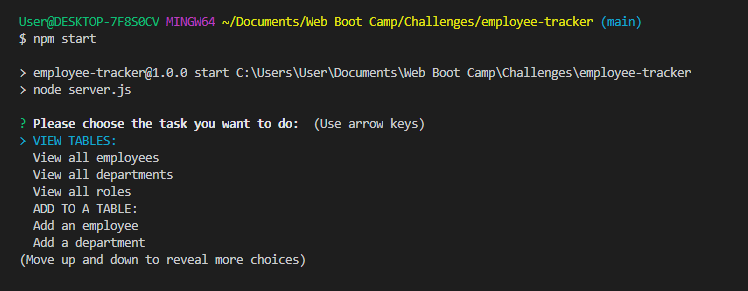

# Employee-Tracker

# Table of Contents:
- [Employee-Tracker](#employee-tracker)
- [Table of Contents:](#table-of-contents)
  - [Description:](#description)
  - [Installation Instructions:](#installation-instructions)
  - [Usage Information:](#usage-information)
  - [License:](#license)
  - [Tests:](#tests)
  - [Questions?](#questions)

## Description: 

This application is a command-line application that manages a company's employee database, using Node.js, inquirer, Console.table, and MySQL2. 
## Installation Instructions:

You will need to install Node.js, npm, inquirer, console.table, and MySQL2 before running this application. Clone the repository at https://github.com/amiedawn/employee-tracker . Then install the Node.js and the other necessary packages. Finally run the application in the terminal by typing “node start”.

## Usage Information:

Follow the installation instructions.  Upon starting the application, a user can view all employees, roles, and departments in the company. The user can also add a department or role. Future development will allow a user to add an employee and update the employee role. Here is a screenshot of the main menu which appears after each main action is complete:   You may also visit to watch a video walk-through of the application: https://drive.google.com/file/d/1UCyg6GDh9Qk1cVOPjOhi-hKkatOuLYis/view .

## License:

This site is under this license: MIT

For details on this license, please follow: https://opensource.org/licenses/MIT

## Tests:

Unit testing was performed on each query using MySQL2.

## Questions?

Please feel free to contact the author of this project at the following:

GitHub: <https://github.com/amiedawn>

Email:  <amiedawn@hotmail.com>